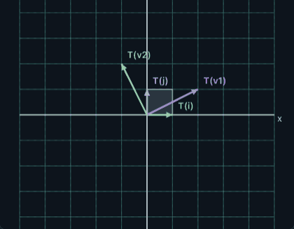
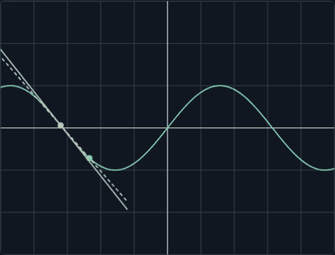
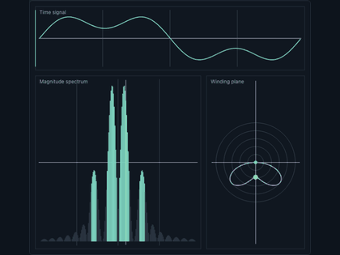
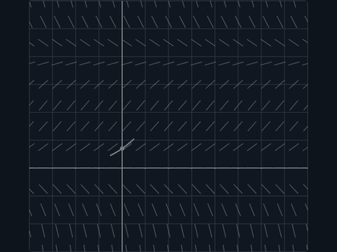
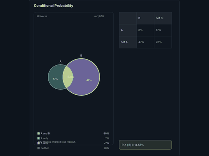
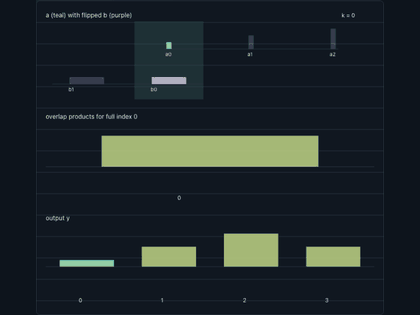

# 形与流

语言：[English](README.md) | 中文

**形与流** 是一个交互式数学可视化实验台，用动态图形、形状变化和直接操作来探索数学结构。你可以拖动点、调整参数、播放动画、比较读数，并保存当前可视化状态。

第一版重点打磨六个可视化模块：线性变换、微积分、傅里叶分析、微分方程、概率和卷积。

## 可视化预览

| 线性变换 | 微积分 | 傅里叶 |
|---|---|---|
|  |  |  |
| **微分方程** | **概率** | **卷积** |
|  |  |  |

## 可以探索什么

形与流围绕“可操作的视觉实验”设计。每个模块都包含一个交互场景、一组可调控件、简洁公式和实时数值读数。

| 模块 | 可视化工具 | 主要内容 |
|---|---|---|
| **矩阵与线性变换** | Matrix Transformations | 矩阵序列、基向量、自定义向量、面积 / 体积缩放、方向翻转、二维和三维线性变换。 |
| **微积分** | Derivative、Integral / Riemann Sums、Fundamental Theorem Connector、Taylor Polynomial | 割线到切线、带符号面积近似、面积累积、局部多项式近似。 |
| **傅里叶变换** | Frequency Spectrum、Signal Reconstruction、Frequency Filtering | 时域信号、频率成分、系数幅度、信号重建和滤波。 |
| **微分方程** | Slope Fields、Numerical Methods、Phase Portraits、Pendulum、Population Dynamics、Heat Equation | 变化规则、解曲线、向量场、数值近似、振子运动、扩散过程。 |
| **概率直觉** | Conditional Probability、Bayes Rule、Medical Test、Binomial Distribution、Continuous Density、Central Limit Theorem、Random Variable Sum | 人群、面积、抽样、分布、基础率、条件概率和采样行为。 |
| **卷积** | Discrete Convolution、Probability Sum、Signal Filtering、Image Kernel、Polynomial Multiplication、Continuous Convolution | 滑动、重叠、相乘再求和，以及它们在信号、概率、图像和代数中的共同模式。 |

## 核心功能

- 基于浏览器的交互式数学场景。
- 使用 Canvas 绘制二维可视化，使用 Three.js 绘制三维可视化。
- 在线性变换中支持矩阵序列和向量追踪。
- 支持滑条、预设、开关和播放控制。
- 实时显示公式、参数和数值结果。
- 支持主题和颜色自定义。
- 支持导出当前画面为 PNG。
- 使用 URL 路由组织模块和可视化工具页面。
- 为核心数学逻辑和部分 UI 行为提供测试。

## 项目状态

形与流目前处于早期公开版本。当前优先级是把第一版六个模块做得更稳定、更统一、更容易探索。

后续路线包括一些已经在源码结构中出现或计划加入的模块：

- 复平面
- 优化
- 神经网络
- 向量场
- 傅里叶级数
- 群论
- 拓扑
- 数论与分形

## 技术栈

- **React**：用户界面结构。
- **TypeScript**：类型化的应用逻辑和数学逻辑。
- **Vite**：开发服务器和生产构建。
- **Canvas 2D**：二维数学场景绘制。
- **Three.js**：三维可视化。
- **KaTeX**：数学公式显示。
- **Vitest**：测试。
- **pnpm**：依赖管理。

## 本地运行

### 前置条件

请先安装 Node.js 和 pnpm。

### 安装依赖

```sh
pnpm install
```

### 启动开发服务器

```sh
pnpm dev
```

然后打开 Vite 在终端中显示的本地地址。

### 构建生产版本

```sh
pnpm build
```

构建结果会生成在 `dist/` 目录中。

### 本地预览生产构建

```sh
pnpm preview
```

### 运行测试

```sh
pnpm test
```

## 项目结构

```text
form-and-flow/
├── public/                 # 静态资源
├── src/
│   ├── app/                # 应用外壳
│   ├── components/         # 共享 React 组件
│   ├── core/               # 共享 UI 和应用工具
│   ├── math/               # 可复用数学逻辑
│   ├── modules/            # 各个可视化模块
│   ├── platform/           # 模块注册、路由、布局和文案
│   ├── render/             # Canvas 和 Three.js 渲染辅助逻辑
│   ├── state/              # 应用状态和 URL 状态辅助逻辑
│   └── test/               # 测试辅助和测试设置
├── index.html
├── package.json
├── tsconfig.json
└── vite.config.ts
```

## 模块设计原则

每个模块都应该像一个可以直接上手的 explorer：

1. 可视化场景打开后就能操作。
2. 控件应该直接改变图像。
3. 读数面板用数字、公式和简短说明解释当前状态。
4. 预设应该提供好的起点。
5. 高级选项应该默认收起，避免干扰主要观察对象。

添加新 explorer 时，建议使用类似结构：

```text
src/modules/<module-name>/
├── manifest.ts             # 模块标题、描述、路由和 explorers
├── <Module>.tsx            # 主模块组件
├── <Module>Home.tsx        # 可选模块主页
├── learningHelp.tsx        # 可选参考说明
└── ...                     # 渲染、状态和辅助文件
```

## 和 Codex / coding agent 协作

这个项目应该保持 visualization-first 的开发方向。让 Codex 或其他 coding agent 修改代码时，可以明确这些边界：

- 保留 explorer 风格界面。
- 优先做直接操作和即时反馈，而不是很长的解释流程。
- 模块页面风格要和第一版六个模块保持一致。
- 数学逻辑、渲染逻辑和 UI 组件尽量分离。
- 修改数学或状态逻辑时补充测试。
- 不要随意大规模重写，除非能让多个模块更一致。

可以使用类似任务提示：

```text
Update the <module> explorer in Form & Flow.
Keep the visualization-first interface.
Do not change unrelated modules.
Add or update tests for any math/state logic you touch.
Run pnpm build and pnpm test before summarizing the change.
```

## 部署说明

形与流是一个 Vite 单页应用。静态部署时：

1. 运行 `pnpm build`。
2. 部署生成的 `dist/` 目录。
3. 如果部署在嵌套路由下，例如 `https://username.github.io/form-and-flow/`，需要把 Vite 的 `base` 选项设置为对应路径。
4. 静态托管服务需要把 `/modules/matrix/transformations` 这类深层路由回退到 `index.html`，否则直接刷新模块页面可能会出现 404。

`pnpm preview` 适合在本地检查生产构建效果；公开部署请使用正式的静态托管服务。

## License

本项目使用 MIT License。详见 [LICENSE](LICENSE)。
